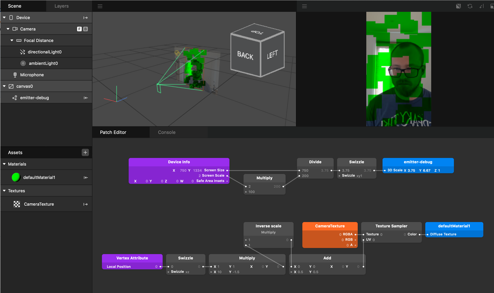

## spark-particle-uv

Demo of how to sample the camera texture and map it to particles.

Features include:
- per-particle texture scaling
- world space mapping
- fit plane type emitter to screen size
- fit particle to screen size
- determine distance between particle and camera

Check out the branches for various techniques. Click to download.

- [Master](https://github.com/positlabs/spark-particle-uv/archive/master.zip) is an aggregate of features that compose my preferred configuration
- [Particle fit2screen](https://github.com/positlabs/spark-particle-uv/archive/particle-fit2screen.zip) will give you a bigass particle that fits the whole screen
- [Camera distance](https://github.com/positlabs/spark-particle-uv/archive/camera-distance.zip) assigns color to each particle based on distance from camera.

### Notes

You may need to import DeviceMotion module in script to activate gyro support on device. For some reason this capability isn't automatically added for world space emitters.

## Resources

Learn more stuff by watching my [Spark AR Tutorials on YouTube!](https://www.youtube.com/playlist?list=PLAZp2Vi7Gfspzyla4RrCO6BzVzYW7Lnb-)

Follow me on Instagram [@positlabs](https://instagram.com/positlabs) and try out my effects!

Browse my open-source [Spark AR repositories on Github!](https://github.com/search?q=user%3Apositlabs+spark)

Have questions? Join the [Spark AR Community](https://www.facebook.com/groups/SparkARcommunity/) group on Facebook.

## Donations

If you used this in client projects, or simply enjoyed making effects with my open-source projects, please consider a donation or sponsorship. One-time donations can be made with PayPal. Subscriptions can be through PayPal or Github Sponsors (click the heart sponsor button at the top of the page).

